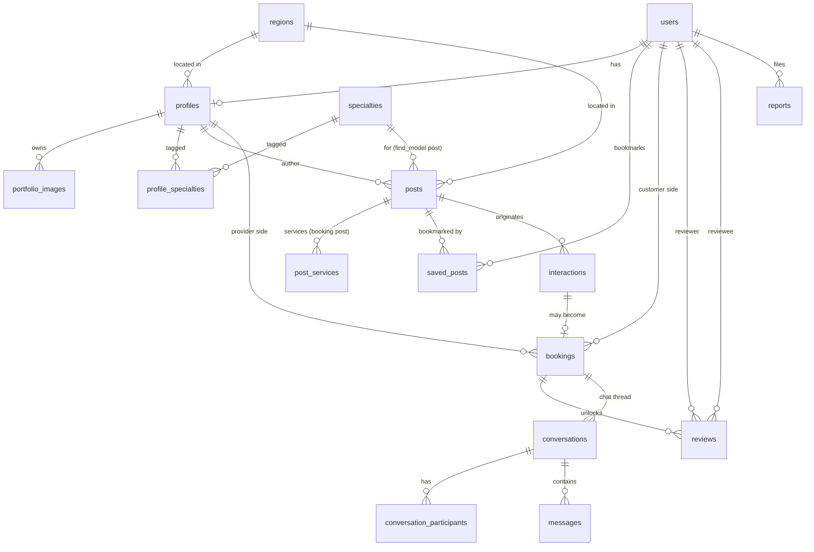

# Data Model — Muse

Bản thiết kế database đầy đủ, thống nhất từ các buổi thảo luận. DB engine: **PostgreSQL**.

Chia làm 3 nhóm:
- **Core (bắt buộc cho MVP)** — account, profile, portfolio, đăng tin, tìm kiếm, kết nối, review, report.
- **Booking/Scheduling (mở rộng)** — đặt lịch hẹn thật với provider. PRD liệt "booking tự động trong app" ngoài scope MVP ban đầu, nhưng thiết kế sẵn để không phải viết lại.
- **Chat (mở rộng)** — chat realtime qua webhook (Pusher/Ably/Stream...). Cũng ngoài scope MVP, thiết kế sẵn chỗ trống.

## ERD tổng quan



## SQL đầy đủ

```sql
-- ============================================================
-- ENUMS
-- ============================================================
CREATE TYPE post_type            AS ENUM ('find_model', 'booking');
CREATE TYPE post_status          AS ENUM ('draft', 'published', 'hidden', 'closed', 'expired');
CREATE TYPE user_level           AS ENUM ('student', 'experienced', 'professional');
CREATE TYPE report_target_type   AS ENUM ('post', 'profile');
CREATE TYPE report_status        AS ENUM ('pending', 'reviewed', 'actioned', 'dismissed');
CREATE TYPE booking_status       AS ENUM ('scheduled', 'completed', 'cancelled', 'no_show');

-- ============================================================
-- CORE — bắt buộc cho MVP
-- ============================================================

CREATE TABLE regions (
  id    UUID PRIMARY KEY DEFAULT gen_random_uuid(),
  name  TEXT NOT NULL,
  slug  TEXT UNIQUE NOT NULL
);

CREATE TABLE specialties (
  id        UUID PRIMARY KEY DEFAULT gen_random_uuid(),
  name      TEXT NOT NULL,
  slug      TEXT UNIQUE NOT NULL,
  is_active BOOLEAN NOT NULL DEFAULT true
);

CREATE TABLE users (
  id             UUID PRIMARY KEY DEFAULT gen_random_uuid(),
  email          TEXT UNIQUE,
  phone          TEXT UNIQUE,
  password_hash  TEXT NOT NULL,
  is_provider    BOOLEAN NOT NULL DEFAULT false,
  is_customer    BOOLEAN NOT NULL DEFAULT false,
  is_admin       BOOLEAN NOT NULL DEFAULT false,
  status         TEXT NOT NULL DEFAULT 'active',
  created_at     TIMESTAMPTZ NOT NULL DEFAULT now(),
  updated_at     TIMESTAMPTZ NOT NULL DEFAULT now(),
  CONSTRAINT chk_email_or_phone CHECK (email IS NOT NULL OR phone IS NOT NULL)
);

CREATE TABLE profiles (
  id           UUID PRIMARY KEY DEFAULT gen_random_uuid(),
  user_id      UUID UNIQUE NOT NULL REFERENCES users(id) ON DELETE CASCADE,
  display_name TEXT NOT NULL,
  avatar_url   TEXT,
  bio          TEXT,
  region_id    UUID NOT NULL REFERENCES regions(id),
  level        user_level NOT NULL,
  created_at   TIMESTAMPTZ NOT NULL DEFAULT now(),
  updated_at   TIMESTAMPTZ NOT NULL DEFAULT now()
);

CREATE TABLE profile_specialties (
  profile_id    UUID NOT NULL REFERENCES profiles(id) ON DELETE CASCADE,
  specialty_id  UUID NOT NULL REFERENCES specialties(id) ON DELETE CASCADE,
  PRIMARY KEY (profile_id, specialty_id)
);

CREATE TABLE portfolio_images (
  id            UUID PRIMARY KEY DEFAULT gen_random_uuid(),
  profile_id    UUID NOT NULL REFERENCES profiles(id) ON DELETE CASCADE,
  specialty_id  UUID REFERENCES specialties(id),
  image_url     TEXT NOT NULL,
  type          TEXT NOT NULL DEFAULT 'single', -- single | before | after
  pair_id       UUID REFERENCES portfolio_images(id),
  position      INT NOT NULL DEFAULT 0,
  created_at    TIMESTAMPTZ NOT NULL DEFAULT now()
);

CREATE TABLE posts (
  id                 UUID PRIMARY KEY DEFAULT gen_random_uuid(),
  profile_id         UUID NOT NULL REFERENCES profiles(id) ON DELETE CASCADE,
  type               post_type NOT NULL,
  title              TEXT NOT NULL,
  description        TEXT,
  region_id          UUID NOT NULL REFERENCES regions(id),
  status             post_status NOT NULL DEFAULT 'draft',

  -- Loại A: Tìm mẫu (null khi type = 'booking')
  specialty_id       UUID REFERENCES specialties(id),
  practice_time      TEXT,
  discount_note      TEXT,
  requirements_text  TEXT,
  slots_total        INT,
  slots_filled       INT DEFAULT 0,

  -- Loại B: Nhận booking (null khi type = 'find_model')
  availability       JSONB,   -- [{ "day_of_week": 1, "start_time": "09:00", "end_time": "18:00" }]
  price_min          NUMERIC, -- derived từ post_services, dùng để filter giá
  price_max          NUMERIC,

  created_at         TIMESTAMPTZ NOT NULL DEFAULT now(),
  updated_at         TIMESTAMPTZ NOT NULL DEFAULT now(),
  expires_at         TIMESTAMPTZ,

  CONSTRAINT chk_find_model_requires_specialty
    CHECK (type <> 'find_model' OR specialty_id IS NOT NULL),
  CONSTRAINT chk_slots_not_overfilled
    CHECK (type <> 'find_model' OR slots_filled <= slots_total)
);

CREATE INDEX idx_posts_feed ON posts (status, region_id, type, created_at DESC);
CREATE INDEX idx_posts_price ON posts (price_min, price_max) WHERE type = 'booking';
CREATE INDEX idx_posts_availability_gin ON posts USING GIN (availability);

CREATE TABLE post_services (
  id                UUID PRIMARY KEY DEFAULT gen_random_uuid(),
  post_id           UUID NOT NULL REFERENCES posts(id) ON DELETE CASCADE,
  service_name      TEXT NOT NULL,
  price_from        NUMERIC,
  price_to          NUMERIC,
  duration_minutes  INT
);
CREATE INDEX idx_post_services_post_id ON post_services(post_id);

CREATE TABLE saved_posts (
  user_id     UUID NOT NULL REFERENCES users(id) ON DELETE CASCADE,
  post_id     UUID NOT NULL REFERENCES posts(id) ON DELETE CASCADE,
  created_at  TIMESTAMPTZ NOT NULL DEFAULT now(),
  PRIMARY KEY (user_id, post_id)
);

-- Ghi nhận NHẸ mọi lượt bấm "Liên hệ" — phục vụ phễu chuyển đổi, không có logic nặng
CREATE TABLE interactions (
  id                   UUID PRIMARY KEY DEFAULT gen_random_uuid(),
  post_id              UUID NOT NULL REFERENCES posts(id) ON DELETE CASCADE,
  provider_profile_id  UUID NOT NULL REFERENCES profiles(id),
  customer_user_id     UUID NOT NULL REFERENCES users(id),
  created_at           TIMESTAMPTZ NOT NULL DEFAULT now()
);

CREATE TABLE reports (
  id                 UUID PRIMARY KEY DEFAULT gen_random_uuid(),
  reporter_user_id   UUID NOT NULL REFERENCES users(id),
  target_type        report_target_type NOT NULL,
  target_id          UUID NOT NULL,
  reason             TEXT NOT NULL,
  description        TEXT,
  status             report_status NOT NULL DEFAULT 'pending',
  resolved_by        UUID REFERENCES users(id),
  resolved_at        TIMESTAMPTZ,
  created_at         TIMESTAMPTZ NOT NULL DEFAULT now()
);

-- ============================================================
-- BOOKING / SCHEDULING — mở rộng (ngoài scope MVP ban đầu)
-- ============================================================

-- Chỉ tạo khi 2 bên THỰC SỰ chốt lịch hẹn cụ thể
CREATE TABLE bookings (
  id                   UUID PRIMARY KEY DEFAULT gen_random_uuid(),
  interaction_id       UUID REFERENCES interactions(id), -- truy ngược nguồn gốc contact, nullable
  provider_profile_id  UUID NOT NULL REFERENCES profiles(id),
  customer_user_id     UUID NOT NULL REFERENCES users(id),
  service_id           UUID REFERENCES post_services(id),
  status               booking_status NOT NULL DEFAULT 'scheduled',
  scheduled_start_at   TIMESTAMPTZ NOT NULL,
  scheduled_end_at     TIMESTAMPTZ NOT NULL,
  note                 TEXT,
  created_at           TIMESTAMPTZ NOT NULL DEFAULT now(),
  updated_at           TIMESTAMPTZ NOT NULL DEFAULT now()
);

-- Review gắn với booking đã hoàn thành (2 chiều: reviewer <-> reviewee)
CREATE TABLE reviews (
  id           UUID PRIMARY KEY DEFAULT gen_random_uuid(),
  booking_id   UUID NOT NULL REFERENCES bookings(id) ON DELETE CASCADE,
  reviewer_id  UUID NOT NULL REFERENCES users(id),
  reviewee_id  UUID NOT NULL REFERENCES users(id),
  rating       SMALLINT NOT NULL CHECK (rating BETWEEN 1 AND 5),
  comment      TEXT,
  created_at   TIMESTAMPTZ NOT NULL DEFAULT now(),
  UNIQUE (booking_id, reviewer_id)
);

-- OPTIONAL: chặn cứng trùng lịch ở tầng DB (bật khi cần độ an toàn tuyệt đối)
-- CREATE EXTENSION IF NOT EXISTS btree_gist;
-- ALTER TABLE bookings
--   ADD CONSTRAINT no_overlapping_schedule
--   EXCLUDE USING gist (
--     provider_profile_id WITH =,
--     tstzrange(scheduled_start_at, scheduled_end_at) WITH &&
--   ) WHERE (status = 'scheduled');

-- ============================================================
-- CHAT — mở rộng (ngoài scope MVP, dùng khi làm realtime qua webhook)
-- ============================================================

CREATE TABLE conversations (
  id               UUID PRIMARY KEY DEFAULT gen_random_uuid(),
  booking_id       UUID REFERENCES bookings(id),
  post_id          UUID REFERENCES posts(id),
  last_message_at  TIMESTAMPTZ,
  created_at       TIMESTAMPTZ NOT NULL DEFAULT now()
);

CREATE TABLE conversation_participants (
  conversation_id  UUID NOT NULL REFERENCES conversations(id) ON DELETE CASCADE,
  user_id          UUID NOT NULL REFERENCES users(id) ON DELETE CASCADE,
  last_read_at     TIMESTAMPTZ,
  PRIMARY KEY (conversation_id, user_id)
);

CREATE TABLE messages (
  id               UUID PRIMARY KEY DEFAULT gen_random_uuid(),
  conversation_id  UUID NOT NULL REFERENCES conversations(id) ON DELETE CASCADE,
  sender_id        UUID NOT NULL REFERENCES users(id),
  content          TEXT,
  attachment_url   TEXT,
  created_at       TIMESTAMPTZ NOT NULL DEFAULT now()
);
CREATE INDEX idx_messages_conversation ON messages (conversation_id, created_at DESC);

-- Log sự kiện webhook từ provider chat (Pusher/Ably/Stream...) — chống xử lý trùng khi provider retry
CREATE TABLE webhook_events (
  id           UUID PRIMARY KEY DEFAULT gen_random_uuid(),
  source       TEXT NOT NULL,
  event_id     TEXT NOT NULL,
  payload      JSONB NOT NULL,
  received_at  TIMESTAMPTZ NOT NULL DEFAULT now(),
  processed_at TIMESTAMPTZ,
  UNIQUE (source, event_id)
);
```

## Ghi chú khi import vào drawDB

Nếu công cụ import báo lỗi ở các dòng `CREATE TYPE ... AS ENUM`, xoá 6 dòng enum ở đầu và đổi các cột dùng enum sang `VARCHAR(20)`, ghi chú giá trị hợp lệ trong note của bảng:
- `posts.type` → `find_model` / `booking`
- `posts.status` → `draft` / `published` / `hidden` / `closed` / `expired`
- `profiles.level` → `student` / `experienced` / `professional`
- `bookings.status` → `scheduled` / `completed` / `cancelled` / `no_show`
- `reports.target_type` → `post` / `profile`
- `reports.status` → `pending` / `reviewed` / `actioned` / `dismissed`

## Quyết định thiết kế đã chốt

| Chủ đề | Quyết định | Lý do |
|---|---|---|
| DB engine | PostgreSQL, không dùng MongoDB | Dữ liệu quan hệ nặng, cần FK/unique/check constraint để DB tự bảo toàn tính đúng đắn nghiệp vụ |
| Vai trò user | Cột boolean `is_provider/is_customer/is_admin` trên `users`, không tách bảng role riêng | 1 tài khoản có thể vừa là thợ vừa là khách, không cần hệ thống permission phức tạp |
| Chuyên ngành | Bảng `specialties` mở, admin CRUD được, có `is_active` để ẩn không xoá | Không phải sửa code khi thêm ngành mới, không vỡ FK dữ liệu cũ |
| Khu vực | Cấp thành phố | Khớp giả định PRD "tập trung vài thành phố lớn" giai đoạn đầu |
| Loại tin (A/B) | 1 bảng `posts` chung + `post_services` riêng, `post_find_model_details` gộp thẳng vào `posts` (cột nullable), `availability` gộp JSONB | Feed trang chủ query 1 bảng duy nhất; `post_services` tách riêng để filter theo giá bằng SQL thường (JSONB khó filter/index hiệu quả) |
| Review | Gắn với `bookings.id` đã `completed`, unique `(booking_id, reviewer_id)` | Chặn review ảo/spam khi 2 bên chưa từng thực sự làm việc cùng nhau |
| Interaction vs Booking | Tách 2 bảng: `interactions` (lượt contact, nhẹ) và `bookings` (lịch hẹn thật, có giờ/dịch vụ/trạng thái) | Tên gọi khớp dữ liệu; tránh nullable tràn lan trên 1 bảng dùng cho 2 mục đích khác nhau |
| Chat | `conversations` + `conversation_participants` (thay vì 2 cột user_a/user_b) + `messages` + `webhook_events` | `conversation_participants` cho phép `last_read_at` riêng từng người và mở rộng group chat sau này; `webhook_events` chống xử lý trùng khi provider chat gửi lại webhook |
